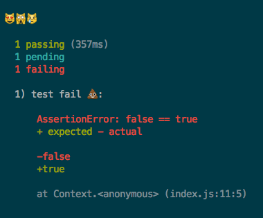

[](https://travis-ci.org/MicheleBertoli/emoji-reporter)

# emoji-reporter
❤️ The best [mocha](https://mochajs.org/) reporter ever

> The best minds of my generation are thinking about how to include emojis in test runner output. That sucks. [@iamdevloper](https://twitter.com/iamdevloper/status/839858241450344448)

## Install

```bash
npm install emoji-reporter --save-dev
```

## Usage

```bash
mocha --reporter=emoji-reporter
```

## Preview



